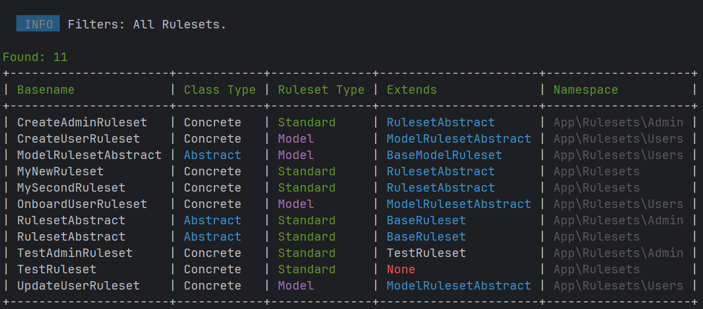

<div align="left">
    <a href="https://github.com/sjshovan/laravel-ruleset-validation">
      <picture>
        
      </picture>
    </a>

<h1>A modular, object-oriented validation system for Laravel.</h1>

[](https://packagist.org/packages/sjshovan/laravel-ruleset-validation)
[](https://github.com/Sjshovan/laravel-ruleset-validation/actions/workflows/test.yaml)
[](https://packagist.org/packages/sjshovan/laravel-ruleset-validation)
</div>

## Abstract

Unlike traditional array-based rules scattered across controllers and form requests,
this package introduces **standalone** and **model-aware** ruleset classes with support for:

* **Rule reuse and extension** via class inheritance
* **Fluent rule composition** within rulesets
* **Centralized rules, messages, and attributes**
* **Seamless integration** with Laravel’s native validator
* **Ruleset management** via Artisan make and list commands

This abstraction addresses the growing complexity and duplication in large Laravel codebases,
where validation rules often become deeply nested, repetitive, or context-specific.

*By shifting validation into dedicated, composable classes, **Laravel Ruleset Validation** enables
**clean architecture**, **code reuse**, and a more scalable approach to application validation.*

### Supported Laravel Versions

| Laravel Versions | Ruleset Validation Version | PHP Version |
|------------------|----------------------------|-------------|
| ≥ 9.x            | 1.x                        | ≥ 8.2       |

---

## Table of Contents

* [Installation](#installation)
* [Quickstart](#quickstart)
* [Defining Rulesets](#defining-rulesets)
    * [Standard Ruleset](#standard-ruleset)
    * [Model-Aware Ruleset](#model-aware-ruleset)
* [Validating Rulesets](#validating-rulesets)
    * [Using the `validator()` Method](#using-the-validator-method)
    * [Using the Factory Decorator](#using-the-factory-decorator)
    * [Using the Concrete Factory Replacement](#using-the-concrete-factory)
* [Extending Rulesets](#extending-rulesets)
    * [Using Intermediate Abstracts](#using-intermediate-abstracts)
* [Fluent RuleBuilder](#fluent-rulebuilder)
* [Artisan Commands](#artisan-commands)
    * [`make:ruleset`](#makeruleset)
    * [`ruleset:list`](#rulesetlist)
* [Configuration](#configuration)
* [Package Utilities](#package-utilities)
* [Testing](#testing)
* [Changelog](#changelog)
* [Contributing](#contributing)
* [Security](#security)
* [License](#license)

---

## Installation

```bash
composer require sjshovan/laravel-ruleset-validation
```

Optionally publish config:

```bash
php artisan ruleset-validation:install
```

---

## Quickstart

```php
use App\Rulesets\UserRuleset;
use App\Models\User;

// Standard ruleset
$ruleset = UserRuleset::new();
$validated = $ruleset->validator([
    'email' => 'foo@example.com',
    'name'  => 'Foo Bar',
])->validate();

// Model-aware ruleset
$user = User::find($id);
$validated = UserRuleset::for($user)->validator([
    'email' => 'foo@example.com',
    'name'  => 'Foo Bar',
])->validate();
```

Example usage for **standard** and **model-aware** rulesets.

---

## Defining Rulesets

Base classes for rulesets:

* `Sjshovan\RulesetValidation\Abstracts\BaseRuleset` – standard rulesets
* `Sjshovan\RulesetValidation\Abstracts\BaseModelRuleset` – model-aware rulesets

### Standard Ruleset

```php
use Sjshovan\RulesetValidation\Abstracts\BaseRuleset;

class UserRuleset extends BaseRuleset
{
    public function rules(): array {
        return $this->builder([
            'email'      => [Rule::email()->rfcCompliant(strict: false), 'max:64'],
            'profession' => 'string',
            'age'        => 'int|min:12',
            'weight'     => 'int'
        ])
        ->add('name', 'string', 'min:4|max:32', ['not_in:hello,world'])
        ->remove('age', 'weight')
        ->prependAll('required')
        ->prepend('profession', 'sometimes')
        ->get();
    }

    public function messages(): array
    {
        return [
            'email.max' => 'Your :attribute may not be greater than :max characters.',
        ];
    }

    public function attributes(): array
    {
        return [
            'email' => 'email address',
        ];
    }
}
```

```php
use App\Rulesets\UserRuleset;
$ruleset = UserRuleset::new();
```

### Model-Aware Ruleset

```php
use Sjshovan\RulesetValidation\Abstracts\BaseModelRuleset;
use App\Models\User;

class UserPostRuleset extends BaseModelRuleset
{
    public static function modelClass(): string 
    {
        return User::class;
    }

    public function rules(): array
    {
        return [
            'slug' => 'required|unique:posts,slug,' . $this->model()->id,
        ];
    }
}
```

```php
use App\Rulesets\UserPostRuleset;
use App\Models\User;

$user = User::findOrFail($id);
$ruleset = UserPostRuleset::for($user);
```

## Validating Rulesets

You can validate rulesets directly from the ruleset itself or by integrating with Laravel’s validator.

### Using the `validator()` Method

```php
$validated = UserRuleset::new()->validator([
    'email' => 'foo@example.com',
    'name'  => 'Foo Bar'
])->validate();
```

All rulesets from the base abstracts include a `validator()` method, returning a fully configured Laravel validator.

### Using the Factory Decorator

```php
Validator::makeFromRuleset(
    UserRuleset::new(), 
    [...]
)->validate();
```

Wraps Laravel’s existing `Illuminate\Validation\Factory` to add the `makeFromRuleset()` method.

* Preserves validator extensions regardless of when they were registered (before or after).
* Drop-in safe for existing apps.

> **Note:** Disabled by default.   
> See [Configuration](#configuration) for enabling instructions via `factory_decorator`.

### Using the Concrete Factory

```php
app(Factory::class)->makeFromRuleset(
    UserRuleset::new(), 
    [...]
)->validate();
```

Replaces Laravel’s `Illuminate\Validation\Factory` with the package’s `RulesetFactory`.

* Lets you type-hint `makeFromRuleset()` directly.
* Extensions work as long as they’re registered after the swap (e.g., in your app’s boot()).

> **Note:** Disabled by default.   
> See [Configuration](#configuration) for enabling instructions via `factory_concrete`.

## Extending Rulesets

Provided tools for custom abstracts:

* `Sjshovan\RulesetValidation\Contracts\Ruleset` – for standard rulesets
* `Sjshovan\RulesetValidation\Contracts\ModelRuleset` - for model-aware rulesets
* `Sjshovan\RulesetValidation\Traits\IsRuleset` – implements `Ruleset` contract
* `Sjshovan\RulesetValidation\Traits\InstantiatesModel` – adds model awareness
* `Sjshovan\RulesetValidation\Traits\HasRuleBuilder` – provides a rule builder
* `Sjshovan\RulesetValidation\Traits\HasRulesetValidator` – provides a ruleset validator

> **Note:** You can override default abstracts for `make:ruleset`.   
> See [Configuration](#configuration) for more details.

### Using Intermediate Abstracts

Intermediate abstracts allow you to define shared rules, messages, or attributes for multiple child rulesets.

```php
namespace App\Rulesets\User;

use Sjshovan\RulesetValidation\Abstracts\BaseRuleset;

abstract class UserRulesetAbstract extends BaseRuleset
{
    public function rules(): array {
        return [
            'email'      => 'email|max:64',
            'profession' => 'string',
            'age'        => 'int|min:12',
            'weight'     => 'int'
        ];
    }
}

class CreateUserRuleset extends UserRulesetAbstract
{
    public function rules(): array
    {
        return $this->builder(parent::rules())
           ->add('name', 'string', 'min:4|max:32', ['not_in:hello,world'])
           ->remove('age', 'weight')
           ->prependAll('required')
           ->prepend('profession', 'sometimes')
           ->get();
    }
}
```

## Fluent RuleBuilder

The `RuleBuilder` lets you start with an empty or existing rules array and fluently add, modify, or remove rules. If you
extend the package’s base abstracts, you get a protected `builder()` method for free within child classes. You can also
instantiate it directly for external use.

```php
use Sjshovan\RulesetValidation\RuleBuilder;

// Basic usage
$rules = RuleBuilder::new(['email' => 'required|string|email'])
    ->add('email', 'max:255')
    ->prepend('email', 'nullable')
    ->get();

// Merge and remove
$rules = RuleBuilder::new(['name' => 'required|string'])
    ->merge(['name' => ['max:50'], 'email' => 'nullable|email'])
    ->remove('name')
    ->get();

// Clear and reset
$rules = RuleBuilder::new(['email' => 'required|email'])
    ->clear()
    ->set('username', 'required')
    ->get();

// Prepend to all
$rules = RuleBuilder::new(['name' => 'string', 'email' => 'email'])
    ->prependAll('required')
    ->get();

// Conditional logic
$isAdmin = true;
$rules = RuleBuilder::new(['role' => 'string'])
    ->when($isAdmin, fn($b) => $b->add('role', 'in:admin,editor'))
    ->get();

// Return as a collection
$collection = RuleBuilder::new(['title' => 'required|string'])->collect();
```

## Artisan Commands

### `make:ruleset`

`php artisan make:ruleset --help`


Generates rulesets in the configured output path, optionally creating model-aware rulesets and intermediate abstracts.

```bash
# Standard ruleset
php artisan make:ruleset MyRuleset

# Model-aware ruleset
php artisan make:ruleset MyRuleset -mUser

# Generate intermediate abstract automatically
php artisan make:ruleset MyRuleset -g

# Dry run (output to console only)
php artisan make:ruleset MyRuleset -d
```

**Intermediate Abstract Behavior:**

**Enabled:**

1. Detects if ruleset is standard or model-aware.
2. Searches for intermediate abstract.
3. If missing, prompts to generate.
4. If declined, extends the configured base abstract.
5. If found, extends it automatically.

**Disabled:**

* Ruleset always extends the configured base abstract.

### `ruleset:list`

`php artisan ruleset:list`


Lists all rulesets in the configured output path, showing which are concrete or abstract, along with their namespaces.

```bash
# List all
php artisan ruleset:list

# Include Standard only
php artisan ruleset:list -s

# Include Model only
php artisan ruleset:list -m

# Include Abstract only
php artisan ruleset:list -a

# Include Concrete only
php artisan ruleset:list -c

# All (default)
php artisan ruleset:list -s -m -a -c
```

**Example output:**



## Configuration

Publish the configuration file:

```bash
php artisan ruleset-validation:install
```

This creates `config/ruleset-validation.php`, where you can adjust:

* **paths** — ruleset output directory and model discovery locations.

* **convention** — default base abstract classes and suffix for ruleset names.

* **behavior** — enable/disable the factory decorator, intermediate abstract generation, and suffix enforcement.

**Default config:**

```php
<?php

return [
    'paths' => [
        'ruleset_output'  => app_path('Rulesets'),
        'model_discovery' => [app_path('Models')],
    ],

    'convention' => [
        'base_abstracts' => [
            'ruleset'       => \Sjshovan\RulesetValidation\Abstracts\BaseRuleset::class,
            'model_ruleset' => \Sjshovan\RulesetValidation\Abstracts\BaseModelRuleset::class,
        ],
        'ruleset_suffix' => 'Ruleset',
    ],

    'behavior' => [
        'factory_decorator' => false,
        'factory_concrete' => false,
        'convention' => [
            'intermediate_abstracts' => true,
            'ruleset_suffix' => true,
        ],
    ],
];
```

> **Note:** See the published config file for descriptions.

## Package Utilities

`Sjshovan\RulesetValidation\Support\Package` is a central utility class that consolidates configuration access, path
resolution, and stub generation for the package.

It provides:

* **Configuration access**

    * Reads from `config/ruleset-validation.php`.
    * Retrieves paths, conventions, and behavior flags.

* **Stub management**

    * Loads stub files from the `/stubs` directory.
    * Renders stubs with placeholder replacements for code generation.

* **Path resolution**

    * Resolves package-relative paths.
    * Provides helpers for output directories and model discovery locations.

* **Behavior toggles**

    * Checks if the factory decorator is enabled.
    * Determines suffix enforcement and intermediate abstract generation.

> **Note:** This class is primarily intended for the package’s internal use. However, its helper methods are available
> if you find them useful in your own code.
****

## Testing

```bash
composer test
```

---

## Changelog

See [changelog.md](changelog.md) for a list of changes.

---

## Contributing

See [contributing.md](contributing.md) for contribution guidelines.

---

## Security

If you discover any security issues, please see [security.md](security.md).

---

## Credits

- [Sid Shovan][link-author]
- [All Contributors][link-contributors]

---

## License

This package is licensed under the MIT License. See [license.md](license.md) for details.

[ico-version]: https://img.shields.io/packagist/v/sjshovan/laravel-ruleset-validation.svg?style=flat-square

[ico-downloads]: https://img.shields.io/packagist/dt/sjshovan/laravel-ruleset-validation.svg?style=flat-square

[ico-travis]: https://img.shields.io/travis/sjshovan/laravel-ruleset-validation/master.svg?style=flat-square

[ico-styleci]: https://styleci.io/repos/12345678/shield

[link-packagist]: https://packagist.org/packages/sjshovan/laravel-ruleset-validation

[link-downloads]: https://packagist.org/packages/sjshovan/laravel-ruleset-validation

[link-travis]: https://travis-ci.org/sjshovan/laravel-ruleset-validation

[link-styleci]: https://styleci.io/repos/12345678

[link-author]: https://github.com/sjshovan

[link-contributors]: ../../contributors
